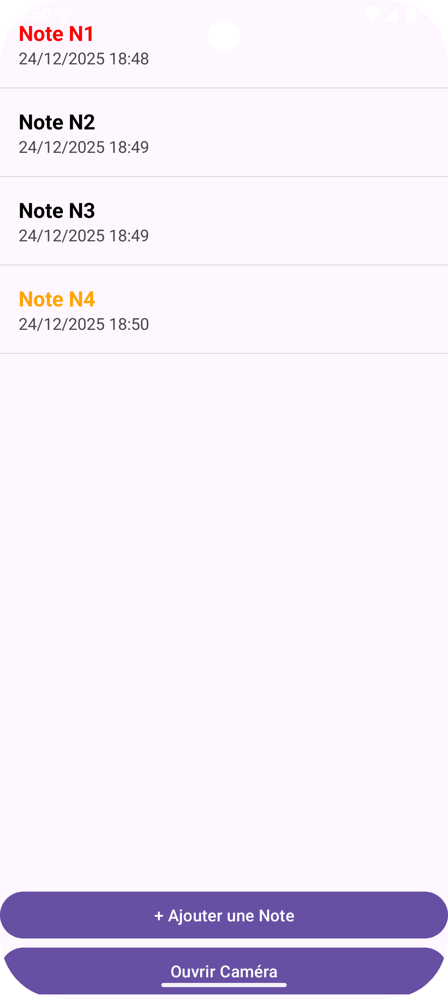
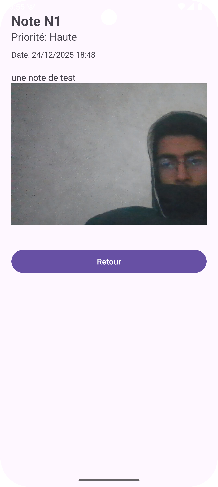

# Application Android MyNotes

**Auteur :** Mohamed Sakhri  
**Date :** 24 Décembre 2025

## Introduction
Ce projet consiste en une application Android native "MyNotes" (v1.0) développée en Java. Elle permet aux utilisateurs de créer, visualiser et gérer des notes personnelles, avec la possibilité de définir des niveaux de priorité et d'attacher des images.


## Fonctionnalités du Projet

### Gestion des Notes
*   **Liste des notes :** Affichage de toutes les notes créées avec leur nom et date. La couleur du texte change dynamiquement en fonction de la priorité (Rouge=Haute, Orange=Moyenne, Vert=Basse).
*   **Ajout de note :** Formulaire permettant de saisir un nom, une description et une priorité. La date et l'heure sont générées automatiquement lors de l'enregistrement.
*   **Détails d'une note :** Consultation complète des informations d'une note.

### Multimédia
*   **Attachement d'image :** Possibilité d'ajouter une image à une note depuis la galerie du téléphone. L'image peut être détachée avant sauvegarde.
*   **Caméra :** Module indépendant permettant de prendre une photo qui est automatiquement sauvegardée dans la galerie publique de l'appareil.

## Étapes de Réalisation

Le développement a suivi les étapes suivantes :

1.  **Configuration du projet :** Initialisation de l'environnement Android Studio et configuration du fichier `AndroidManifest.xml` (activités, permissions caméras).
2.  **Modélisation :** Création de la classe `Note.java` implémentant `Serializable` pour le transfert de données, incluant les champs titre, description, date, priorité et URI d'image.
3.  **Interface Utilisateur (XML) :** Conception des layouts pour chaque activité (`activity_note_list`, `activity_add_note`, etc.) et pour les items de la liste (`item_note`).
4.  **Logique Métier (Java) :**
    *   Implémentation des Activités (`Activity`) pour gérer la navigation et les interactions.
    *   Gestion des `Intents` pour la communication entre écrans et l'accès à la galerie/caméra.
5.  **Améliorations :** Automatisation de la date, gestion de la sauvegarde d'image dans `MediaStore`, et ajout de la fonctionnalité d'attachement d'image.

## Zoom sur le NoteAdapter

Le `NoteAdapter` est un composant central de l'application. C'est lui qui fait le lien entre les données (la liste des objets `Note`) et l'interface utilisateur (le composant `ListView`).

### Rôle
Son rôle est de transformer chaque objet `Note` de notre liste en une vue (`View`) affichable à l'écran. Il permet de personnaliser l'affichage de chaque ligne de la liste, ce que l'adaptateur par défaut d'Android ne permet pas de faire aussi finement.

### Fonctionnement Interne
Le `NoteAdapter` hérite de la classe `ArrayAdapter<Note>`. Le cœur de sa logique réside dans la méthode `getView()` :

1.  **Recyclage de la vue :** La méthode reçoit une `convertView`. Si elle est nulle, l'adaptateur "gonfle" (inflate) le layout XML personnalisé `item_note.xml`. Cela optimise les performances en réutilisant les vues existantes lors du défilement.
2.  **Association des données :** Il récupère l'objet `Note` correspondant à la position actuelle dans la liste.
3.  **Remplissage des vues :** Il injecte les données de la note (nom, date) dans les `TextView` correspondants.
4.  **Logique conditionnelle (Priorité) :** C'est ici qu'intervient la spécificité demandée :
    ```java
    switch (currentNote.getPriorite()) {
        case "Haute": tvNom.setTextColor(Color.RED); break;
        case "Moyenne": tvNom.setTextColor(Color.rgb(255, 165, 0)); break;
        case "Basse": tvNom.setTextColor(Color.GREEN); break;
        // ...
    }
    ```
    Cette structure de contrôle change la couleur du titre de la note en fonction de sa priorité avant de renvoyer la vue finale à la liste.

## Captures d'écran

| Liste des Notes | Ajout de Note | Détails de Note |
|:---:|:---:|:---:|
|  |  |  |
